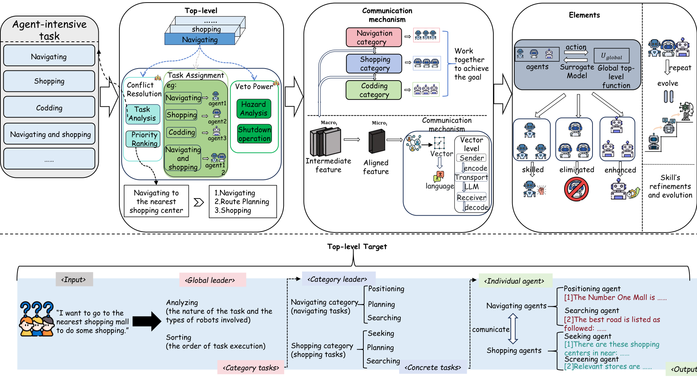

# TTEA: A Self-Reinforcing Multi-Agent Approach for Large-Scale Complex Systems

<div align="center">

[](https://pytorch.org/)
[](https://huggingface.co/docs/transformers/)
[](#license)

</div>

## Abstract

Large language model (LLM) agents are increasingly deployed in shared web services and complex interactive environments. However, most existing frameworks optimize for single-agent reasoning capabilities, often neglecting the global utility, coordination, and resource efficiency of the entire multi-agent organization. To address this, we propose TTEA (Top-level Target Entity Association), a system-level orchestration framework for heterogeneous intelligent agents. Formulating multi-agent coordination as a joint-reward optimization problem, TTEA integrates a global top-level objective, a dynamic skill adaptation mechanism for local decision-making, and a cross-level latent communication stack to mitigate context bloat and sub-goal conflicts. Built on a standard transformers backend, TTEA operates seamlessly without requiring rigid, predefined coordination protocols. We evaluate the framework across long-horizon web navigation, collaborative software engineering, and knowledge-intensive reasoning tasks. Across six public benchmarks, TTEA demonstrates state-of-the-art robustness and efficiency, achieving a 41.7\% average success rate on WebArena, a 21.3\% issue resolution rate on SWE-bench Lite, and 80.09\% accuracy on ARC-Challenge, while remaining highly competitive on short-answer generation.

## Framework Overview

<p align="center">
  
</p>
<p align="center">
  Revised TTEA implementation used by the paper and the reproducibility configs for the main benchmark suite.
</p>

## Highlights

- Revised TTEA implementation used by the paper and the reproducibility configs for the main benchmark suite.
- Main paper scope covers web navigation (`WebArena`, `MiniWoB++`), collaborative software engineering (`SWE-bench Lite`), and knowledge-intensive support (`PubHealth`, `ARC-Challenge`, `SQuAD`, `ASQA`).
- Translation support remains in the repository as an optional extension, but it is no longer part of the main-paper evaluation path.
- System-level TTEA runtime with top-level objective, impact assessment, evolution, and cross-level knowledge collaboration.
- Real environment adapters for `WebArena` and `MiniWoB++`.
- Structured issue-record execution support for `SWE-bench Lite` style software engineering tasks.
- Real Hugging Face `transformers` model loading, training, and inference.
- Benchmark-aligned evaluation for web, software engineering, and knowledge-intensive tasks, with persistent metrics, predictions, traces, summaries, and checkpoint indexes.

## Installation

### Base installation

```powershell
python -m venv .venv
.venv\Scripts\Activate.ps1
pip install -U pip
pip install -e .
```

### Optional dependencies

```powershell
pip install -e .[dev]
pip install -e .[integration]
pip install -e .[web]
playwright install chromium
```

## Datasets

Datasets are not bundled in this repository. Place them under `data/datasets/`.

| Dataset | Local path | Acquisition URL | Notes |
| --- | --- | --- | --- |
| WebArena | `data/datasets/webarena` | <https://github.com/web-arena-x/webarena> | real web benchmark |
| MiniWoB++ | `data/datasets/miniwobpp` | <https://miniwob.farama.org/> | BrowserGym / Gymnasium tasks |
| SWE-bench Lite | `data/datasets/swebench_lite` | <https://huggingface.co/datasets/princeton-nlp/SWE-bench_Lite> | software engineering issue records |
| PubHealth | `data/datasets/pubhealth` | <https://huggingface.co/datasets/health_fact> | fact verification |
| ARC-Challenge | `data/datasets/arc_challenge` | <https://allenai.org/data/arc> | multiple-choice reasoning |
| SQuAD | `data/datasets/squad` | <https://rajpurkar.github.io/SQuAD-explorer/> | extractive QA |
| ASQA | `data/datasets/asqa` | <https://github.com/google-research/language/tree/master/language/asqa> | long-form QA |
| JRC-Acquis | `data/datasets/jrc_acquis` | <https://opus.nlpl.eu/JRC-Acquis.php> | optional translation extension |

Inspect local dataset availability with:

```powershell
ttea describe-datasets
```

## Quick Reproduction

After `pip install -e .`, the commands below can be executed through the `ttea` CLI.

### 1. Inspect the experiment plan

```powershell
ttea plan-experiment --experiment configs/experiments/webarena.json
ttea plan-experiment --experiment configs/experiments/swebench_lite.json
```

### 2. Preview a small number of tasks

```powershell
ttea dry-run --experiment configs/experiments/asqa.json --limit 2
ttea dry-run --experiment configs/experiments/swebench_lite.json --limit 2
```

### 3. Train the revised text benchmarks

```powershell
ttea train-experiment --experiment configs/experiments/pubhealth.json
ttea train-experiment --experiment configs/experiments/arc_challenge.json
ttea train-experiment --experiment configs/experiments/squad.json
ttea train-experiment --experiment configs/experiments/asqa.json
```

### 4. Evaluate experiments

```powershell
ttea run-experiment --experiment configs/experiments/webarena.json --split test
ttea run-experiment --experiment configs/experiments/miniwob.json --split test
ttea run-experiment --experiment configs/experiments/swebench_lite.json --split test
ttea run-experiment --experiment configs/experiments/pubhealth.json --split test
ttea run-experiment --experiment configs/experiments/arc_challenge.json --split test
ttea run-experiment --experiment configs/experiments/squad.json --split test
ttea run-experiment --experiment configs/experiments/asqa.json --split test
```

### 5. Paper result summaries

- `result/web_navigation.json`
- `result/software_engineering.json`
- `result/knowledge_enhancement.json`
- `result/ablation.json`
- `result/translation.json`

### 6. Optional translation extension

```powershell
ttea train-experiment --experiment configs/experiments/jrc_acquis.json
ttea run-experiment --experiment configs/experiments/jrc_acquis.json --split test
```

## Main Reproduction Configurations

### Main config files

- Main platform config: `configs/platform.json`
- Revised paper benchmark summary: `configs/paper/revision_benchmark_suite.json`

Main paper experiment configs:

- `configs/experiments/webarena.json`
- `configs/experiments/miniwob.json`
- `configs/experiments/swebench_lite.json`
- `configs/experiments/pubhealth.json`
- `configs/experiments/arc_challenge.json`
- `configs/experiments/squad.json`
- `configs/experiments/asqa.json`

Ablation configs:

- `configs/experiments/ablation_top_level_objective.json`
- `configs/experiments/ablation_evolution.json`
- `configs/experiments/ablation_communication.json`

### Global platform parameters

| Module | Key parameters |
| --- | --- |
| Top-level objective | `alpha=12.0`, `beta=8.0`, `delta=9.0`, `gamma=1.0` |
| Stability floor / resource budget | `0.35 / 100.0` |
| Evolution | `skill_learning_rate=0.08`, `system_gain=1.75`, `skill_decay=0.015`, `decay_window=3`, `elimination_threshold=-5.0` |
| Communication | `encoder_dim=16`, `feature_grid_size=4`, `confidence_threshold=0.35`, `fusion_mode=attention`, `fusion_heads=4` |
| Generation backend | `google/flan-t5-base`, `max_prompt_tokens=256`, `temperature=0.2`, `top_p=0.9`, `max_new_tokens=96` |

Benchmark-specific settings are mirrored in `configs/paper/revision_benchmark_suite.json`.

## Main Code Path

The main runtime path is:

1. `src/ttea/cli.py`
2. `src/ttea/experiments/runners.py`
3. `src/ttea/runtime.py`
4. `src/ttea/execution/engine.py`
5. `src/ttea/evaluation/benchmarks.py`
6. `src/ttea/persistence/results.py`
7. `src/ttea/persistence/checkpoints.py`

Communication-specific modules:

- `src/ttea/core/communication.py`
- `src/ttea/core/objective.py`
- `src/ttea/core/assessment.py`
- `src/ttea/evolution/operators.py`

## Output Artifacts

Each experiment run can write:

- `config_snapshot.json`
- `plan.json`
- `summary.json`
- `metrics.json`
- `predictions.jsonl`
- `task_traces.jsonl`
- `training_summary.json`
- `training_history.jsonl`
- `checkpoints.json`

## Notes

- The revised paper scope is web navigation, collaborative software engineering, and knowledge-intensive support benchmarks.
- Translation support remains in the codebase as an optional extension.
- The old third-party communication README has been removed; the active communication mechanism is now the native implementation in `src/ttea/core/communication.py`.
- Web benchmarks require their external environments and browser dependencies to be installed separately.
- The software engineering benchmark uses structured issue records in this repository; full repository checkout, sandboxed test execution, and API-backed coding loops remain external to the lightweight release.

## License

This project is released under the `MIT` license.
